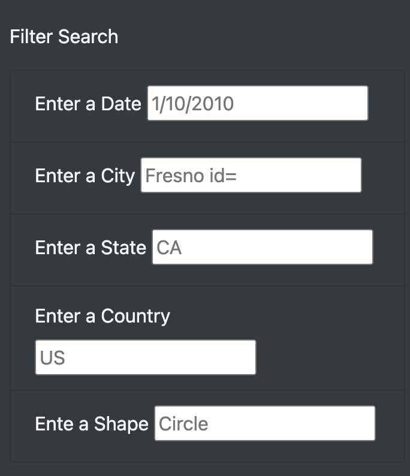

#UFOs

[link to webpage](https://luis-zavalaa.github.io/UFOs/)
##Overview of Project
* Providing a dynamic table on a webpage which allows users to filter data about UFO sightings in different parts of the world.

##Results

*We have successfully created the dynamic table with the ability to filter out data based on the users preferences. In the visual above we can see how we can filter by the date of the sighting, the city, state, country, as well as shape of the object!

##Summary: 
* One thing that could be improved at the webpage would be possibly redirecting after the cited filter as the table part of the webpage could be viewed as too small. Especially if the filtered data is more than about 5 rows.
